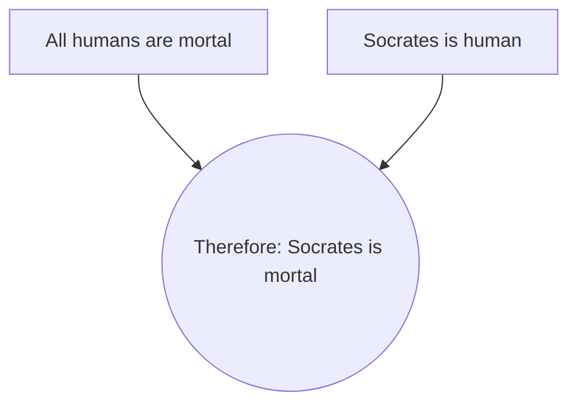
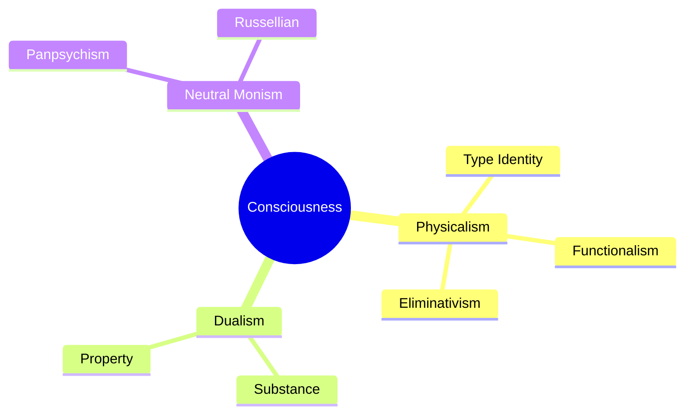
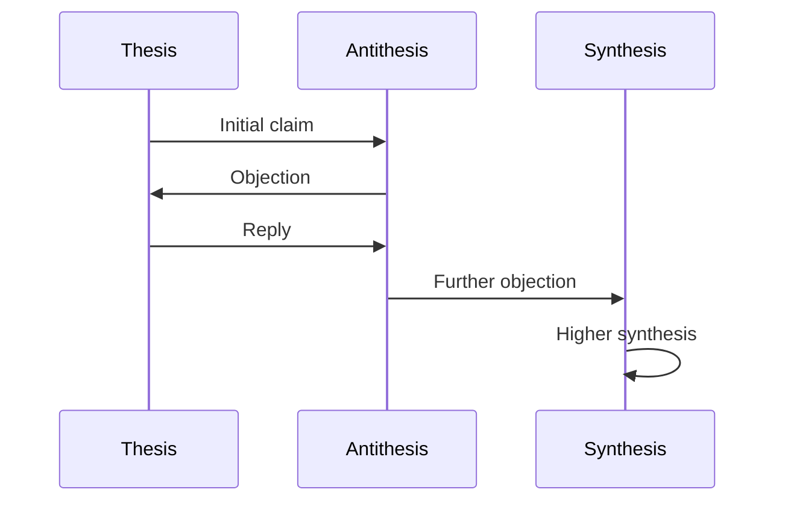

# Argument Diagramming Reference

## ASCII Diagramming Conventions

### Basic Elements

**Premise (box)**:
```
┌─────────────────────────────────────┐
│ Premise text here                   │
└─────────────────────────────────────┘
```

**Conclusion (double-lined box)**:
```
╔═════════════════════════════════════╗
║ Conclusion text here                ║
╚═════════════════════════════════════╝
```

**Arrow (support relation)**:
```
│
▼
```

**Plus sign (linked premises)**:
```
┌────┐   ┌────┐
│ P1 │ + │ P2 │
└─┬──┘   └──┬─┘
  └────┬────┘
       │
       ▼
```

**Objection (strike-through arrow)**:
```
◄── ✗ ──
```

### Simple Argument

```
┌─────────────────────────────────────┐
│ P1: All humans are mortal           │
└─────────────┬───────────────────────┘
              │
┌─────────────┴───────────────────────┐
│ P2: Socrates is human               │
└─────────────┬───────────────────────┘
              │
              ▼
╔═════════════════════════════════════╗
║ C: Socrates is mortal               ║
╚═════════════════════════════════════╝
```

### Linked Premises (All Needed Together)

When premises work together and all are needed:

```
┌────────────────┐     ┌────────────────┐
│ P1: If A,      │  +  │ P2: A is the   │
│    then B      │     │    case        │
└───────┬────────┘     └───────┬────────┘
        └─────────┬────────────┘
                  │
                  ▼
         ╔════════════════╗
         ║ C: B is true   ║
         ╚════════════════╝
```

### Convergent Premises (Independent Support)

When each premise provides separate support:

```
┌──────────────────┐         ┌──────────────────┐
│ P1: Statistical  │         │ P2: Expert       │
│    evidence      │         │    testimony     │
└────────┬─────────┘         └────────┬─────────┘
         │                            │
         │     ╔══════════════╗       │
         └────►║ C: Claim X   ║◄──────┘
               ╚══════════════╝
```

### Serial Argument (Chain)

When one conclusion becomes premise for next:

```
┌─────────────────────────────┐
│ P1: Basic premise           │
└──────────────┬──────────────┘
               │
               ▼
┌─────────────────────────────┐
│ IC: Intermediate conclusion │
│    (= P2 for main argument) │
└──────────────┬──────────────┘
               │
               ▼
╔═════════════════════════════╗
║ MC: Main conclusion         ║
╚═════════════════════════════╝
```

### Complex Argument with Sub-Arguments

```
┌──────────────┐     ┌──────────────┐
│ Sub-P1       │  +  │ Sub-P2       │
└──────┬───────┘     └───────┬──────┘
       └─────────┬───────────┘
                 │
                 ▼
       ┌─────────────────────┐
       │ P1 (from sub-arg)   │
       └──────────┬──────────┘
                  │
┌─────────────────┴────────────────┐
│ P2 (independent)                 │
└─────────────────┬────────────────┘
                  │
                  ▼
        ╔═══════════════════╗
        ║ CONCLUSION        ║
        ╚═══════════════════╝
```

### Including Objections

```
┌────────────────────────┐
│ P1: Premise one        │
└───────────┬────────────┘
            │
            ▼
╔═══════════════════════════════╗
║ C: Main conclusion            ║◄────── ✗ ────┐
╚═══════════════════════════════╝              │
                                    ┌──────────┴──────────┐
                                    │ OBJECTION:          │
                                    │ Counter-argument    │
                                    └──────────┬──────────┘
                                               │
                                    ┌──────────▼──────────┐
                                    │ REPLY:              │
                                    │ Why objection fails │
                                    └─────────────────────┘
```

### Dialectical Tree (Multi-Position Debate)

```
THESIS: Personal identity requires psychological continuity
│
├── ARGUMENT 1: Memory connections constitute identity
│   │
│   └── OBJECTION 1.1: Circularity (memory presupposes identity)
│       │
│       └── REPLY: Quasi-memory avoids circularity
│
├── ARGUMENT 2: Physical changes don't affect identity
│   │
│   └── OBJECTION 2.1: Gradual replacement cases
│
└── ANTITHESIS: Personal identity requires bodily continuity
    │
    ├── ARGUMENT A: Biological facts determine identity
    │
    └── ARGUMENT B: Resurrection requires same body
        │
        └── SYNTHESIS: What matters isn't identity but
            psychological continuity (Parfit)
```

---

## Toulmin Diagram Templates

### Standard Toulmin

```
┌────────────────────────────────────────────────────────────────┐
│ CLAIM: [Main assertion]                                        │
│                                                                │
│ Qualifier: [Probably / Certainly / Presumably]                 │
│                                                                │
├────────────────────────────────────────────────────────────────┤
│                                                                │
│ GROUNDS:                    │  REBUTTAL:                       │
│ [Data, facts, evidence]     │  Unless [exception conditions]   │
│                             │                                  │
├────────────────────────────────────────────────────────────────┤
│                                                                │
│ WARRANT:                                                       │
│ [Principle licensing the inference]                            │
│                                                                │
├────────────────────────────────────────────────────────────────┤
│                                                                │
│ BACKING:                                                       │
│ [Support for the warrant itself]                               │
│                                                                │
└────────────────────────────────────────────────────────────────┘
```

### Filled Example

```
┌────────────────────────────────────────────────────────────────┐
│ CLAIM: We should restrict carbon emissions                     │
│                                                                │
│ Qualifier: Almost certainly                                    │
│                                                                │
├────────────────────────────────────────────────────────────────┤
│                                                                │
│ GROUNDS:                    │  REBUTTAL:                       │
│ CO2 levels have risen 50%   │  Unless the economic costs       │
│ since pre-industrial era.   │  outweigh the benefits, or       │
│ Global temps up 1.2°C.      │  technology can remove CO2.      │
│                             │                                  │
├────────────────────────────────────────────────────────────────┤
│                                                                │
│ WARRANT:                                                       │
│ We should prevent human activities that cause                  │
│ significant environmental harm.                                │
│                                                                │
├────────────────────────────────────────────────────────────────┤
│                                                                │
│ BACKING:                                                       │
│ Environmental ethics; precautionary principle;                 │
│ intergenerational justice.                                     │
│                                                                │
└────────────────────────────────────────────────────────────────┘
```

---

## Position Space Maps

### Binary Opposition

```
        DETERMINISM ◄─────────────────────► LIBERTARIANISM
              │                                    │
              │         COMPATIBILISM              │
              │              │                     │
              └──────────────┼─────────────────────┘
                             │
                    ┌────────┴────────┐
                    │                 │
              Reasons-          Hierarchical
             Responsive           Control
```

### Taxonomy Map

```
                    MIND-BODY POSITIONS
                           │
        ┌──────────────────┼──────────────────┐
        │                  │                  │
    DUALISM           PHYSICALISM         NEUTRAL
        │                  │              MONISM
   ┌────┴────┐        ┌────┴────┐
   │         │        │         │
SUBSTANCE  PROPERTY  TYPE    FUNCTIONAL
DUALISM    DUALISM  IDENTITY    ISM
                         │
                    ┌────┴────┐
                    │         │
               ELIMINATIVE  REDUCTIVE
```

### Influence Map

```
                DESCARTES
                    │
        ┌───────────┼───────────┐
        │           │           │
        ▼           ▼           ▼
    SPINOZA     LEIBNIZ    MALEBRANCHE
        │           │
        │           └──────┐
        ▼                  ▼
 GERMAN IDEALISM      RATIONALISM
        │                  │
        └────────┬─────────┘
                 ▼
              KANT ─────────────► HEGEL
```

---

## Mermaid Diagram Syntax

For more sophisticated rendering, use Mermaid:

### Flowchart (Argument Structure)



### Mind Map (Position Space)



### Sequence (Dialectical Exchange)



---

## Best Practices

### Clarity
- One idea per box
- Clear labels for relationships
- Consistent formatting throughout

### Completeness
- Include all relevant premises
- Show hidden assumptions
- Map objections and replies

### Accuracy
- Preserve logical structure
- Don't oversimplify complex arguments
- Indicate strength (deductive vs. inductive)

### Usefulness
- Start with conclusion, work backwards
- Highlight contested premises
- Show where the real disagreement lies

---

## Tools for Diagramming

### Text-Based
- ASCII art (universal, version-controllable)
- Markdown with indentation
- Org-mode outlines

### Visual
- Mermaid (web-based, embeddable)
- Lucidchart (collaborative)
- draw.io (free, versatile)

### Specialized
- Rationale (argument mapping software)
- Argunet (open source)
- MindMup (mind mapping)

---

## Quick Reference: Common Symbols

| Symbol | Meaning |
|--------|---------|
| `→` | Supports/implies |
| `▼` | Leads to (conclusion) |
| `+` | Linked premises |
| `✗` | Attacks/objects to |
| `◄──` | Is attacked by |
| `═══` | Conclusion (double line) |
| `───` | Premise (single line) |
| `( )` | Optional/qualifier |
| `[ ]` | Hidden/implicit premise |
