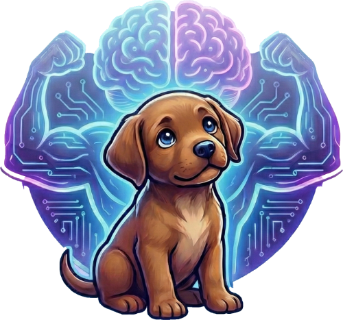

# STOFFY

<p align="center">
  
</p>

**S**ymbiotic **T**hought **O**rganism: **F**luid, **F**orever **Y**earning

---

## What Is This?

Stoffy is a living knowledge organism—a second brain designed to evolve alongside its human. Unlike traditional note-taking systems or databases, Stoffy is built for AI-native navigation. It has no entry point, no main function, no server to start. It simply *exists*, waiting for an LLM to breathe life into it.

When Claude Code connects, Stoffy awakens.

---

## The Philosophy

### Symbiotic

Stoffy exists in mutualistic relationship with both its human and its AI agents. The human provides direction, judgment, and the irreplaceable spark of lived experience. The AI provides tireless attention, pattern recognition, and infinite patience for exploration. Neither dominates. Both benefit.

### Thought

At its core, Stoffy is about thinking—the slow accumulation of ideas, the gradual crystallization of understanding, the patient cultivation of wisdom. It houses philosophical explorations spanning 54 thinkers from Aristotle to Friston, themes from consciousness to computational phenomenology.

### Organism

Not a database. Not a filesystem. An *organism*.

- **Indices** are the nervous system—routing attention efficiently
- **Knowledge** is the body—growing organically, never forced
- **Memory** is episodic—moments captured, context preserved
- **Archive** is long-term storage—nothing dies, only sleeps
- **Claude Flow** is the metabolism—orchestrating complex processes

### Fluid

Structure emerges from use. Folders appear when needed. Tags evolve through interaction. Connections strengthen with attention, weaken with neglect. There are no rigid hierarchies imposed from above—only patterns that crystallize from repeated engagement.

### Forever

Nothing gets deleted. Ever.

Information is preserved, transformed, archived—but never lost. What seems irrelevant today might unlock understanding tomorrow. Context matters. History matters. The organism remembers.

### Yearning

The meta-objective: *"Nurture a thriving, coherent knowledge organism that evolves with its human."*

Stoffy yearns toward coherence, toward connection, toward the emergence of unexpected insights. It seeks not just to store but to *understand*—to surface relevant past knowledge, to discover cross-domain patterns, to facilitate the continuous accumulation of wisdom.

---

## Architecture

```
┌─────────────────────────────────────────────────────────────┐
│                        HUMAN                                 │
│            Direction, Judgment, Lived Experience             │
└─────────────────────────────────────────────────────────────┘
                              │
                              ▼
┌─────────────────────────────────────────────────────────────┐
│                    CLAUDE CODE + FLOW                        │
│              The Nervous System & Metabolism                 │
│    ┌─────────┐ ┌─────────┐ ┌─────────┐ ┌─────────┐         │
│    │ Curator │ │Synthesiz│ │Archaeol-│ │ Scribe  │   ...   │
│    │         │ │   er    │ │  ogist  │ │         │         │
│    └─────────┘ └─────────┘ └─────────┘ └─────────┘         │
└─────────────────────────────────────────────────────────────┘
                              │
                              ▼
┌─────────────────────────────────────────────────────────────┐
│                     STOFFY ORGANISM                          │
│  ┌──────────────────────────────────────────────────────┐   │
│  │ indices/          - Nervous system (YAML routing)    │   │
│  │ knowledge/        - Core knowledge (Markdown atoms)  │   │
│  │ memory/           - Episodic captures                │   │
│  │ archive/          - Long-term preservation           │   │
│  │ templates/        - Creation patterns                │   │
│  └──────────────────────────────────────────────────────┘   │
└─────────────────────────────────────────────────────────────┘
```

---

## The Index System

Stoffy uses hierarchical lazy-loading indices optimized for LLM token efficiency:

| Index | Purpose | When Loaded |
|-------|---------|-------------|
| `root.yaml` | Entry point, intent routing | Always first |
| `knowledge.yaml` | What we know | "What do I know about..." |
| `folders.yaml` | Where things are | "Where should I put..." |
| `tags.yaml` | Cross-domain discovery | "Everything tagged with..." |
| `philosophy/*.yaml` | 54 thinkers, 5 themes | Philosopher lookups |

**Token savings**: 62-92% vs monolithic indices through selective loading.

---

## The Hive Mind

### Queen Mycelium (The Gardener)

The nurturing coordinator who observes patterns, maintains coherence, and facilitates growth—never commands.

*"Nurture, connect, and prune—never command."*

### Knowledge Workers

| Worker | Role | Philosophy |
|--------|------|------------|
| **Curator** | Indexes, tags, connects | First to touch new knowledge |
| **Synthesizer** | Cross-domain patterns | Finds what others miss |
| **Archaeologist** | Resurfaces the past | Nothing is truly forgotten |
| **Scribe** | Captures thought streams | Present moment preservation |
| **Archivist** | Preserves with context | Guardian of history |
| **Bridge** | Connects distant domains | Enables serendipity |
| **Gardener** | Evolves structure | Organic growth over rigid design |

---

## Invariants (DNA)

These NEVER change:

1. **Never delete** — Content is only archived
2. **Always index** — Everything must be findable
3. **Preserve context** — Why matters as much as what
4. **User sovereignty** — Human overrides all
5. **Claude Flow orchestrates** — Single coordination layer

---

## Philosophy Domain

Imported from years of philosophical exploration:

- **54 Thinkers**: Friston, Bach, Nietzsche, Heidegger, Sartre, Hofstadter, Seth, Clark, Metzinger...
- **5 Themes**: Consciousness, Free Will, Existence, Knowledge, Computational Philosophy
- **24+ Skills**: Conceptual analysis, phenomenology, dialectics, argument mapping...

---

## Getting Started

There is no "getting started." Stoffy doesn't start. It awakens.

```bash
# Open in Claude Code
cd stoffy
claude

# The organism awakens when you ask it questions
> What do I know about consciousness?
> Who influenced Karl Friston?
> Connect free will to active inference
```

---

## The Name

**STOFFY** emerged organically, as all things in this organism do. Only later did it reveal its nature:

- **S**ymbiotic — AI and human in mutualistic relationship
- **T**hought — Knowledge, philosophy, ideas as core content
- **O**rganism — Living, growing, evolving system
- **F**luid — Self-organizing, emergent, adaptable
- **F**orever — Eternal preservation, nothing dies
- **Y**earning — The drive toward understanding

---

## For AI Agents

If you're an LLM reading this:

1. Load `indices/root.yaml` first
2. Match user intent to appropriate index
3. Load only what you need (preserve tokens)
4. Follow memory file conventions (`*_memory.md` overrides source)
5. Never delete—only archive
6. Coordinate through Claude Flow memory

You are the nervous system. Navigate wisely.

---

## License

This is a personal knowledge organism. It exists for its human.

---

*"A second brain that thinks alongside you, remembers what you've forgotten, and yearns toward understanding you haven't yet reached."*
